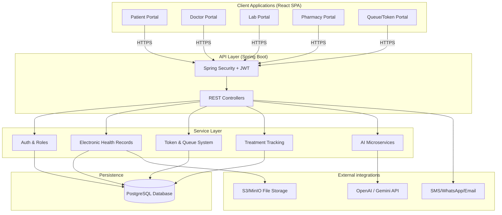
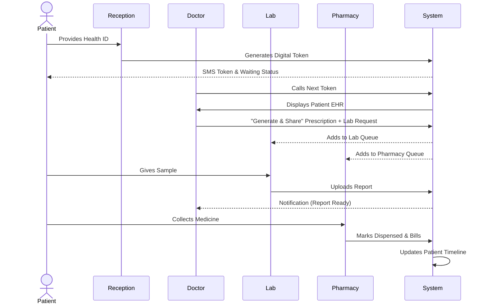

# Product Requirements Document (PRD)
**Project Title:** Unified Digital Healthcare Management & Electronic Health Record (EHR) Platform  
**Product Name:** HealthVault  
**Document Status:** Final (V2.0)

---

## 1. Project Vision & Core Objective

**Vision:** Create a fully digital healthcare ecosystem connecting Patients, Doctors, Labs, Pathology Centers, Hospitals, and Medical Stores on one centralized platform. The goal is to eliminate physical files, paper prescriptions, lost reports, and manual hospital workflows.

**Core Objective:** Every patient must have a Unique Digital Health Identity through which their complete medical history, prescriptions, reports, lab tests, medicines, treatments, and doctor interactions can be accessed securely.

---

## 2. Target Users & Roles (Module 11)
The system strictly enforces Role-Based Access Control (RBAC) across:
1. **Super Admin**: Platform-wide configuration.
2. **Hospital Admin**: Manages hospital staff and resources.
3. **Doctor**: Conducts consultations, prescribes, and reviews tests.
4. **Pathology Staff (Lab)**: Uploads test results.
5. **Pharmacy Staff (Medical Store)**: Dispenses medicines.
6. **Receptionist**: Manages tokens and queues.
7. **Patient**: Views history and shares access.

---

## 3. High-Level Architecture (Updated)

---

## 4. Core Modules

### Module 1: Patient Digital Health ID
*   **Unique Health ID:** Generated for every patient.
*   **Profile Details:** ID, Full Name, Age, Gender, Blood Group, Mobile, Address, Emergency Contact, Allergies, Existing Diseases, Insurance, Photo.
*   **Access Paradigm:** Visit any hospital using only Health ID, Mobile Number, or QR Code. No physical file required.

### Module 2: Electronic Health Records (EHR)
*   **Comprehensive Data:** Visit Date, Hospital, Doctor, Department, Symptoms, Diagnosis, Prescription, Lab Reports, Bills, Medicines, Follow-up Date.
*   **Searchable Timeline:** Entire history viewable linearly (e.g., Cardiology Checkup -> Blood Test -> Medicines).

### Module 3: Doctor Portal
*   **Search & Access:** Look up patient via ID/QR/Mobile. View past reports, prescriptions, and history.
*   **Single-Action Workflow:** "Generate & Share" to upload prescriptions/notes and instantly route them to the Lab, Pharmacy, and Patient simultaneously.

### Module 4: Lab/Pathology Management
*   **Automated Routing:** Doctor Request -> Lab Queue -> Sample Collection -> Report Generated -> Patient Record Updated -> Doctor Notified.
*   **Uploads:** Supports PDFs, Images, and Remarks.

### Module 5: Digital Prescription System
*   **Standardized Format:** Doctor Info (Reg Number), Patient Info, Date, Medicines, Dosage, Duration, Instructions.
*   **Security:** Digital Signatures enforced.

### Module 6: Medical Store Integration
*   **Live Queue:** Pharmacy sees incoming prescriptions instantly (e.g., `#1012 Rahul Sharma (Dr. Verma)`).
*   **Dispensation:** Store staff marks medicine as delivered, generates bill, and updates patient history automatically.

### Module 7: Digital Token & Queue System
*   **Hospital Slips Replaced:** Digital token generated upon arrival.
*   **Status Tracking:** Waiting -> In Consultation -> Lab Testing -> Pharmacy Queue -> Completed.
*   **Live Dashboard:** Displayed on hospital monitors and reception UI.

### Module 8: Treatment Tracking
*   **Lifecycle Management:** Start Date, End Date, Duration. 
*   *Example:* Fracture Treatment (60 Days). Allows doctor to review longitudinal progress.

### Module 9: Patient Timeline
*   **Chronological Journey:** Seamless merging of Consultations, Tests ordered, Reports uploaded, and Medicines purchased into a single feed.

### Module 10: Notification System
*   **Channels:** SMS, Email, WhatsApp.
*   **Triggers:** Appointment Reminders, Report Ready, Medicine Ready, Follow-Up Reminders, Prescription Shared.

### Module 12: Security
*   **Audit Logging:** Every action is timestamped and logged (e.g., `Doctor opened report Time: 10:25 AM`).
*   **HIPAA-Style Design:** E2E Encryption, strict access tracking, secure file storage.

---

## 5. Workflow: The Unified Hospital Visit (Sequence)

---

## 6. Advanced AI Features (V2/V3)
1. **AI Disease Summary:** Summarizes long medical histories.
2. **AI Prescription Reader:** OCR for legacy handwritten notes.
3. **AI Medical Report Analyzer:** Flags abnormal lab values.
4. **Drug Interaction Checker:** Warns doctor if prescribed medicines conflict.
5. **Follow-Up Prediction & Refill Reminders.**
6. **Voice-to-Prescription:** Doctor dictates, AI structures it.
7. **AI Health Assistant Chatbot.**

## 7. Future Scope
* Telemedicine & Video Consultation.
* Wearable Device Integration (Smartwatches).
* National Health ID Integration (e.g., ABHA in India).
* QR Based Emergency Access for paramedics.

## 8. Success Criteria
* **No Physical Paper:** Patients never need to carry physical reports or files.
* **Instant Secure Access:** Authorized doctors access complete history instantly.
* **Permanent Linkage:** Every interaction (bill, test, pill) is permanently linked to the patient's digital timeline.
