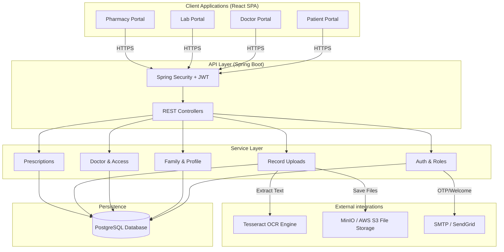
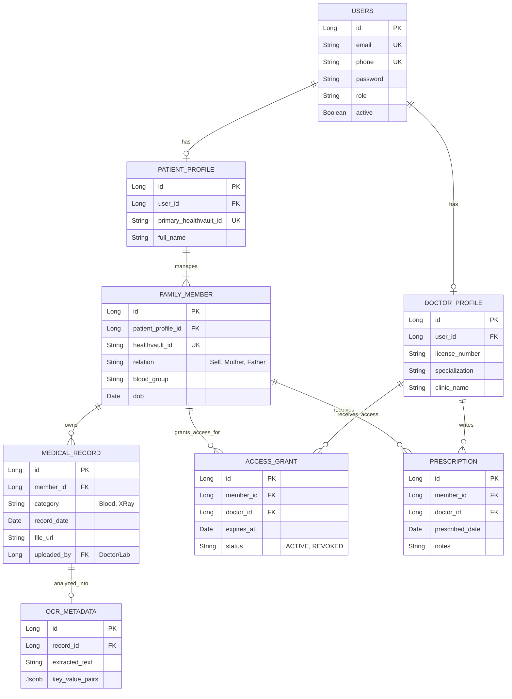
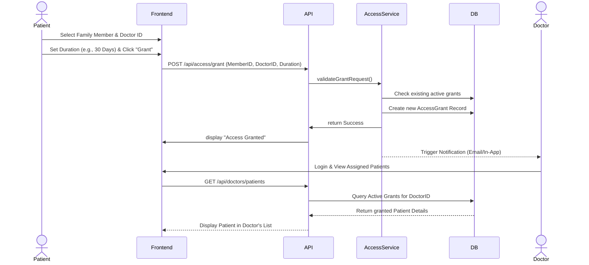
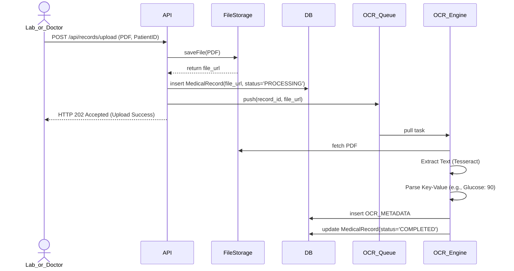

# Product Requirements Document (PRD)
**Product Name:** HealthVault  
**Tagline:** "One Patient. One Medical History."  
**Document Status:** Draft (Architectural Focus)

---

## 1. Executive Summary

HealthVault is a unified healthcare record management ecosystem. It connects Patients, Doctors, Laboratories, Pharmacies, and Hospital Staff on a single secure platform. By providing a secure digital vault, HealthVault ensures that a patient's complete medical history is always accessible to authorized individuals, improving diagnosis accuracy and empowering families to manage their health records efficiently.

**Note:** HealthVault is a centralized health record management ecosystem, *not* a telemedicine or appointment booking platform.

---

## 2. High-Level System Architecture

The architecture relies on a monolithic backend (Spring Boot) with clear module boundaries, communicating with a modern SPA (React) frontend. It integrates an external OCR Engine for document text extraction and an S3-compatible object store for medical files.

---

## 3. Database Schema (Entity-Relationship Diagram)

The data model isolates authentication (Users) from domain-specific profiles. Family members act as the anchor for medical records to allow one patient account to manage multiple people.

---

## 4. Core Workflows (Sequence Diagrams)

### 4.1 Doctor Access Grant Flow
This sequence demonstrates how a patient grants a doctor access to their family member's records.

### 4.2 Medical Record Upload & OCR Extraction Flow
This sequence shows the asynchronous background processing of a medical report upload.

---

## 5. Module Specific Requirements

### Module 1: Family Health Profiles
*   **Hierarchical Management:** The primary account holder registers using Email/Phone. They then create `Family Member` profiles.
*   **HealthVault ID Assignment:** Every member is assigned a system-generated ID (e.g., `HV-938210`). This ID is the primary key for sharing data.

### Module 2: Access Management (The Vault)
*   **Default State:** All records are private. Doctors, Labs, and Pharmacies cannot search for or view a patient's history without an explicit `ACCESS_GRANT`.
*   **Time-To-Live (TTL):** Access grants must have an expiration timestamp. A scheduled cron job will mark expired grants as `EXPIRED`, instantly revoking access.

### Module 3: OCR & Smart Search
*   **Ingestion:** When a PDF/Image is uploaded, it is queued for OCR processing.
*   **Searchability:** Patients and authorized doctors can use a global search bar. The backend performs a full-text search across `OCR_METADATA.extracted_text`, `PRESCRIPTION.notes`, and `MEDICAL_RECORD.category`.

### Module 4: Medical Timeline Builder
*   **Data Aggregation:** The timeline API fetches data from `MEDICAL_RECORD`, `PRESCRIPTION`, and `PHARMACY_RECORDS` sorting them chronologically descending.
*   **UI Representation:** Visual nodes connected by a line, color-coded by category (e.g., Red for Blood Test, Green for Prescription).

---

## 6. Dashboard Layouts (Wireframe Concepts)

### Patient Dashboard
1.  **Header:** Welcome message, active profile selector (Self, Mother, Father).
2.  **Top Cards:** "Total Records", "Active Doctors", "Recent Uploads".
3.  **Main View (Timeline):** Chronological feed of medical events.
4.  **Sidebar:** Navigation (My Records, Share Access, Prescriptions, Settings).

### Doctor Dashboard
1.  **Header:** Doctor Profile, Clinic Name.
2.  **Search Bar:** Global search for "HealthVault ID".
3.  **Main View (Assigned Patients):** List of patients who have granted active access, with a countdown timer showing days left for access.
4.  **Quick Actions:** "Upload Prescription", "Add Clinical Note".

---

## 7. Security & Compliance Guardrails

1.  **No Telemedicine:** Do not build video calls or chat features.
2.  **No Booking System:** Do not build doctor availability calendars or appointment slots.
3.  **Strict RBAC:** API Gateway must strictly intercept and validate roles. A Doctor ID requesting a Patient ID's record must be verified against the `ACCESS_GRANT` table on every single request.
4.  **Audit Logs:** Every read/write operation on a Medical Record must insert a row into an `AUDIT_LOG` table containing Timestamp, UserID, IP Address, and Action.
